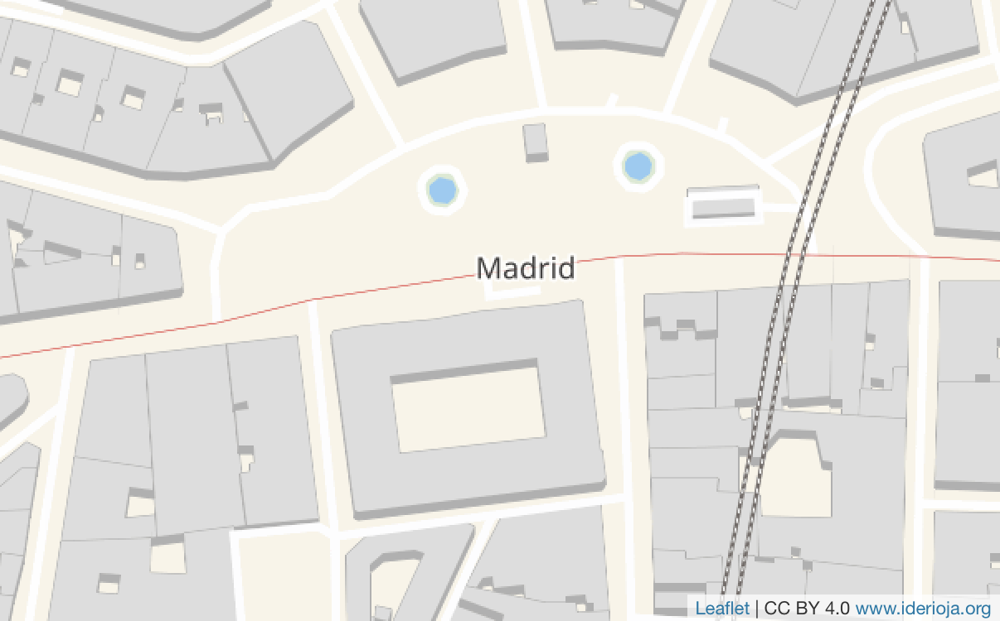

  

# leaflet-providersESP

An extension to Leaflet that contains configurations for various free WMS/WMTS tile providers of Spain.

Compatible with [leaflet-providers](https://github.com/leaflet-extras/leaflet-providers)

## Instalation 

### Via CDN


```html
<!-- Latest -->
<script src="https://cdn.jsdelivr.net/gh/dieghernan/leaflet-providersESP/dist/leaflet-providersESP.min.js"></script>

<!-- By version -->
<script src="https://cdn.jsdelivr.net/gh/dieghernan/leaflet-providersESP@v1.0.0/dist/leaflet-providersESP.min.js"></script>

```

### Local

Get [leaflet-providersESP.js](https://github.com/dieghernan/leaflet-providersESP/tree/master/dist):

```html
<!-- Last version -->
<script src="./path/to/your/folder/leaflet-providersESP.js"></script>
```

## Usage

```html
<body>
	<div id="mapid"></div>
	<script src="https://cdn.jsdelivr.net/gh/dieghernan/leaflet-providersESP@v1.0.0/dist/leaflet-providersESP.min.js"></script>
	<script>
	var mymap = L.map('mapid').setView([40.4166, -3.7038400], 18);
	  L.tileLayer.providerESP('IDErioja').addTo(mymap);
	</script>
</body>
```




[Full demo](https://dieghernan.github.io/leaflet-providersESP/) and [providers](https://dieghernan.github.io/leaflet-providersESP#proveedores-disponibles) (ES).
